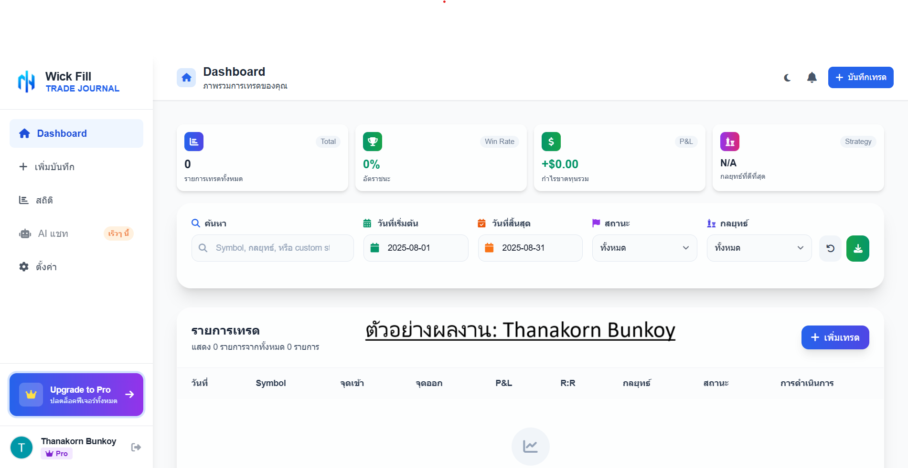
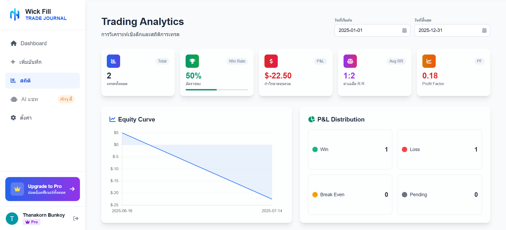
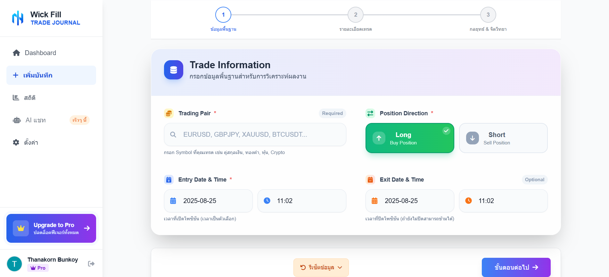
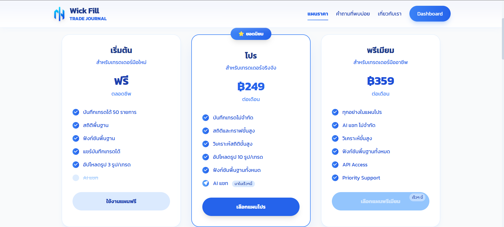

# Trade Journal Platform

A web application for logging and analyzing trades.  
Built with **Laravel, Livewire, Tailwind CSS, MySQL**, and **Stripe Integration**.

## Features
- Trade logging with entry/exit, fees, tags, and notes
- Image upload with per-image notes
- P/L calculation and performance analytics
- Stripe subscription (Hosted Checkout)

## Tech Stack
Laravel, Livewire, Tailwind CSS, MySQL, Stripe

## Screenshots






## Quick Start
```bash
git clone https://github.com/keaykub/trade-journal-pro.git
cd trade-journal-pro
composer install
npm install
cp .env.example .env
php artisan key:generate
php artisan migrate --seed
npm run dev
php artisan serve
